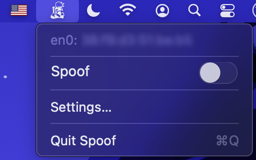

# Spoof

`Spoof` is a simple MacOS status bar application for spoofing a `MAC` address. It relies on a privileged helper to set the `MAC` address of the primary interface with `ifconfig`. `Spoof` is written using `Objective-C`.



## Usage

Building `Spoof` requires `Xcode` and can be build using the GUI or from the command line with:

```shell
xcodebuild -scheme SpoofHelperTool build
xcodebuild -scheme Spoof build 
```

For the latter, the `Spoof` application is found in the `build/Release` folder as `Spoof.app`.

Double-clicking `Spoof.app` starts the application, which will present itself as a status bar item. The status bar item
uses the [Stratego](https://en.wikipedia.org/wiki/Stratego) spy character as an icon when spoofing is active, otherwise the [Stratego](https://en.wikipedia.org/wiki/Stratego) marshal character is used. Clicking the status bar icon will open a menu that lists as its first item the primary interface with its currently assigned `MAC` address.

## Configuration

 Spoofing is enabled/disabled by toggling the `Spoof` switch. The `MAC` address used for spoofing can be configured by clicking the `Settings` menu item, which will open a panel where an address can be entered.

## Notes

1. Application `Signing` could require updating from within `Xcode` as no public certificate is provided for `Spoof`. The `Team` and `Signing Certificate` can be set to a `Personal Team` and `Development`, respectively, to run locally. The `Info.plist` files might also require updating, notably the keys `Tools owned after installation` and `Clients allowed to add and remove tool`.
2. Because `Spoof` requires elevated privileges to change the `MAC` address using `ifconfig`, it needs a privileged helper tool to function. It might ask to install it upon first launch, which can require providing an administrator's username/password.

## BSD-3 License

Redistribution and use in source and binary forms, with or without modification, are permitted provided that the following conditions are met:

1. Redistributions of source code must retain the above copyright notice, this list of conditions and the following disclaimer.

2. Redistributions in binary form must reproduce the above copyright notice, this list of conditions and the following disclaimer in the documentation and/or other materials provided with the distribution.

3. Neither the name of the copyright holder nor the names of its contributors may be used to endorse or promote products derived from this software without specific prior written permission.

THIS SOFTWARE IS PROVIDED BY THE COPYRIGHT HOLDERS AND CONTRIBUTORS "AS IS" AND ANY EXPRESS OR IMPLIED WARRANTIES, INCLUDING, BUT NOT LIMITED TO, THE IMPLIED WARRANTIES OF MERCHANTABILITY AND FITNESS FOR A PARTICULAR PURPOSE ARE DISCLAIMED. IN NO EVENT SHALL THE COPYRIGHT HOLDER OR CONTRIBUTORS BE LIABLE FOR ANY DIRECT, INDIRECT, INCIDENTAL, SPECIAL, EXEMPLARY, OR CONSEQUENTIAL DAMAGES (INCLUDING, BUT NOT LIMITED TO, PROCUREMENT OF SUBSTITUTE GOODS OR SERVICES; LOSS OF USE, DATA, OR PROFITS; OR BUSINESS INTERRUPTION) HOWEVER CAUSED AND ON ANY THEORY OF LIABILITY, WHETHER IN CONTRACT, STRICT LIABILITY, OR TORT (INCLUDING NEGLIGENCE OR OTHERWISE) ARISING IN ANY WAY OUT OF THE USE OF THIS SOFTWARE, EVEN IF ADVISED OF THE POSSIBILITY OF SUCH DAMAGE.
